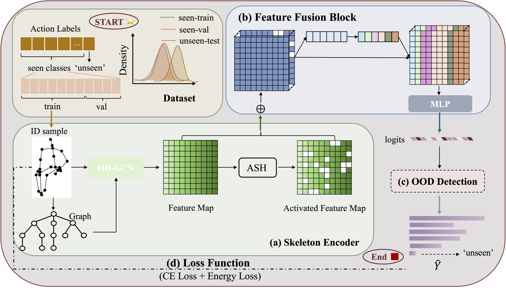

# Skeleton-OOD
Official implementation of Skeleton-OOD: An End-to-End Skeleton-Based Model for Robust Out-of-Distribution Human Action Detection
.  
[Arxiv paper](https://arxiv.org/abs/2405.20633)

<div align="center">
    
</div>

# Abstract
Human action recognition is a crucial task in computer vision systems. However, in real-world scenarios, human actions often fall outside the distribution of training data, requiring a model to both recognize in-distribution (ID) actions and reject out-of-distribution (OOD) ones. Despite its importance, there has been limited research on OOD detection in human actions. Existing works on OOD detection mainly focus on image data with RGB structure, and many methods are post-hoc in nature. While these methods are convenient and computationally efficient, they often lack sufficient accuracy and fail to consider the presence of OOD samples. To address these challenges, we propose a novel end-to-end skeleton-based model called Action-OOD, specifically designed for OOD human action detection. Unlike some existing approaches that may require prior knowledge of existing OOD data distribution, our model solely utilizes in-distribution (ID) data during the training stage, effectively mitigating the overconfidence issue prevalent in OOD detection. We introduce an attention-based feature fusion block, which enhances the model's capability to recognize unknown classes while preserving classification accuracy for known classes. Further, we present a novel energy-based loss function and successfully integrate it with the traditional cross-entropy loss to maximize the separation of data distributions between ID and OOD. Through extensive experiments conducted on NTU-RGB+D 60, NTU-RGB+D 120, and Kinetics-400 datasets, we demonstrate the superior performance of our proposed approach compared to state-of-the-art methods. Our findings underscore the effectiveness of classic OOD detection techniques in the context of skeleton-based action recognition tasks, offering promising avenues for future research in this field.  


# Dependencies

- Python >= 3.6
- PyTorch >= 1.10.0
- PyYAML == 5.4.1
- torchpack == 0.2.2
- matplotlib, einops, sklearn, tqdm, tensorboardX, h5py, pandas, seaborn
- Run `pip install -e torchlight` 

# Data Preparation

### Download datasets.

#### There are 3 datasets to download:

- NTU RGB+D 60 Skeleton
- NTU RGB+D 120 Skeleton
- Kinetics 400

#### NTU RGB+D 60 and 120 

1. Request dataset here: https://rose1.ntu.edu.sg/dataset/actionRecognition
2. Download the skeleton-only datasets:
   1. `nturgbd_skeletons_s001_to_s017.zip` (NTU RGB+D 60)
   2. `nturgbd_skeletons_s018_to_s032.zip` (NTU RGB+D 120)
   3. Extract above files to `./data/nturgbd_raw`

#### Kinetic 400
1. Follow the previous work [ST-GCN](https://github.com/yysijie/st-gcn/blob/master/OLD_README.md), we downloaded the pre-processed data from 
[GoogleDrive](https://drive.google.com/open?id=103NOL9YYZSW1hLoWmYnv5Fs8mK-Ij7qb). 
2. Put the extracted files in the data path you specified, but remember to keep it consistent with the data path in the `./data/process/kinetics_unseen.py`

### Data Processing

- Generate NTU RGB+D 60 or NTU RGB+D 120 dataset:

```
 cd ./data/ntu # or cd ./data/ntu120
 # Get skeleton of each performer
 python get_raw_skes_data.py
 # Remove the bad skeleton 
 python get_raw_denoised_data.py
 # Transform the skeleton to the center of the first frame
 python seq_transformation.py
 # select and encode unseen categories 
 cd process
 python nturgbd-unseen.py
```
- Generate Kinetics dataset:

```
 cd ./data/process
 # select and encode unseen categories 
 python kinetics-unseen.py
```

- generate mix-test dataset for NTU and Kinetics dataset:
```
 cd ./data/process
 python cat_seen_unseen.py
```

# Training & Testing
### Training
    python main.py -config config/nturgbd-cross-label/joint_com_seen_ashp-mlp-loss-56.yaml
    python main.py -config config/nturgbd120-cross-label/seen_ashp-mlp-loss-111.yaml
    python main.py -config config/kinetics400-cross-label/seen_ashp-mlp-loss-368.yaml

### Testing
    python main.py -config [your work path]/workdir/nturgbd-cross-label/cross-label/config-mix.yaml
    python main.py -config [your work path]/workdir/nturgbd120-cross-label/cross-label/config-mix.yaml
    python main.py -config [your work path]/workdir/kinetics400-cross-label/cross-label/config-mix.yaml
